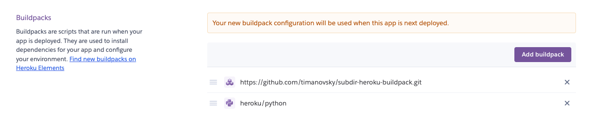

# How to run the webserver: 
Run the webserver locally via 

``` python3 app.py ```


Deploy a new version

``` git push heroku master ```


# Recreating this website:

### In order to spin up your own instance of the website from this repo

1. Create heroku app (Can be done online via Heroku GUI)
2. Within the app, go to Settings
   1. Within Config Vars, Set "PROJECT_PATH" to "Website" (We're creating a config/env var called PROJECT_PATH, which should point to the folder that holds our app.py file)
   2. Add buildpacks in this order (ORDER MATTERS HERE)
      1. https://github.com/timanovsky/subdir-heroku-buildpack.git
      2. heroku/python
      3. Make sure it looks like this: 
        
3. Clone this Git Repo to local system
4. Change the necessary git information
   1. ``` $ heroku git:remote -a example-app ``` 
    
        ```# example-app shoul dbe the name of your new heroku app ```
    1. Change to point to your own github repo
        
        ``` git remote set-url origin http://github.com/YOU/YOUR_REPO ```


